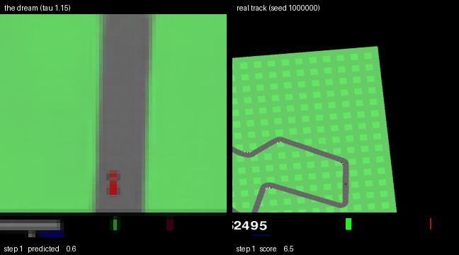

# Lucid Dream Racer

A world model for CarRacing-v3 — a VAE for vision, an MDN-RNN for dynamics and memory, and
an 867-parameter linear controller evolved with CMA-ES. A reproduction of Ha &
Schmidhuber's *World Models* [1], plus the experiment they ran on VizDoom but not on
CarRacing: **training the controller entirely inside the learned model**, and measuring
what breaks when it doesn't work.

📄 **[Technical note](reports/technical_note.pdf)** — the full report, with every
measurement and the negative results.



*Left: the controller driving inside the model's imagination. Right: the same controller on
a real track.*

## Results

100 unseen test tracks, interquartile mean with a 95% bootstrap confidence interval.

| Controller trained | IQM [95% CI] | Mean (sd) |
|---|---|---|
| In the simulator | **924.8** [922.1, 926.5] | 908.4 (68.0) |
| Inside the model, after the repair loop | **710.3** [652.3, 761.2] | 630.7 |
| Inside the model, before it | 209.6 [176.7, 248.7] | 251.7 (184.8) |

924.8 clears the conventional 900 threshold. Compared mean to mean, 908.4 (sd 68.0)
reproduces the 906 (sd 21) reported in [1].

## What I found

**The model is exploited, not merely inaccurate.** Started 30 steps before the car leaves
the road and steered by the controller, the model reports a mean probability of 0.89 that
the car is on the road over the next 100 steps. The same actions, run in the simulator,
keep the car on the road 35% of the time. Hold a *constant* input instead and the model
scores it correctly — the error only appears when the controller chooses the actions. With
867 parameters and thousands of evaluations inside the model, CMA-ES finds wherever the
model is wrong in its favour.

**The state drifts after about 20 imagined steps.** Fed real frames, the model reads road
status correctly 96–97% of the time at any horizon. Fed its own predictions, it holds for
roughly 20 steps, then falls to 0.84 at steps 20–40 and 0.35 at steps 70–100. That is
exactly the horizon on which the consequences of a steering error appear.

**Feeding real outcomes back works, by making the model less generous.** A loop that
replays the model's chosen actions in the simulator and fine-tunes on the windows with the
largest error raised model-trained drivers from 209.6 to 710.3 IQM in two rounds. The
exploit gap closed because predicted return fell from 121 to 82, not because real return
rose.

**Four targeted fixes failed.** Road-ranked data, an on-road output with a penalty,
training on the model's own predictions, and a road-status loss all left the 20–40 step
disagreement where it was. A loss on what the model *outputs* cannot recover information
its *state* has already lost.

**One diagnostic caught my own false positive.** Imagined latents appeared to sit 350
Mahalanobis units outside the data manifold. They did not: sampled latents were being
compared against posterior means, and half the latent dimensions are inactive, so the
metric was dominated by dimensions carrying no information. Both errors independently
produce a confident wrong conclusion. See §3.3.1 of the note.

**The simulator-trained controller has one hard edge.** It shrugs off reduced throttle
(921.6) and moderate pixel noise (907.9 at σ = 25), and collapses under a 20% reduction in
road friction (14.7). It understeers, spins, stops — and because the policy is
deterministic, a stationary car facing off-track outputs zero throttle, reproducing the
same frame forever. An absorbing state, not a gradual loss of skill.

## Repository

```
ldr/            the pipeline: vae, mdnrnn, controller, dream, loop, evaluation
diagnostics/    the measurements behind every claim in the note
reports/        figures, per-track evaluations, the technical note
tests/          shape and contract tests, one file per phase
```

## Reproduce

```bash
pip install -e ".[app,baseline,dev]"
bash scripts/run_all.sh
```

Everything ran on one Apple Silicon laptop. Controller training in the simulator takes
about 12 hours for 300 generations; inside the model, about 20 minutes for 500.

## Limitations

Single seed per configuration. Every repair-loop result rests on one run of three drivers,
and the spread between those drivers (482.7 to 886.3 IQM) is larger than most differences
between runs. No model-free baseline, so the comparison is between two ways of training the
same architecture, not against PPO or SAC.

## References

1. Ha, D. & Schmidhuber, J. (2018). [World Models](https://arxiv.org/abs/1803.10122).
2. Hafner, D. et al. (2023). [Mastering Diverse Domains through World
   Models](https://arxiv.org/abs/2301.04104).
3. Towers, M. et al. (2024). [Gymnasium](https://arxiv.org/abs/2407.17032).
4. Hansen, N. (2016). [The CMA Evolution Strategy: A
   Tutorial](https://arxiv.org/abs/1604.00772).
5. Agarwal, R. et al. (2021). [Deep Reinforcement Learning at the Edge of the Statistical
   Precipice](https://arxiv.org/abs/2108.13264).
