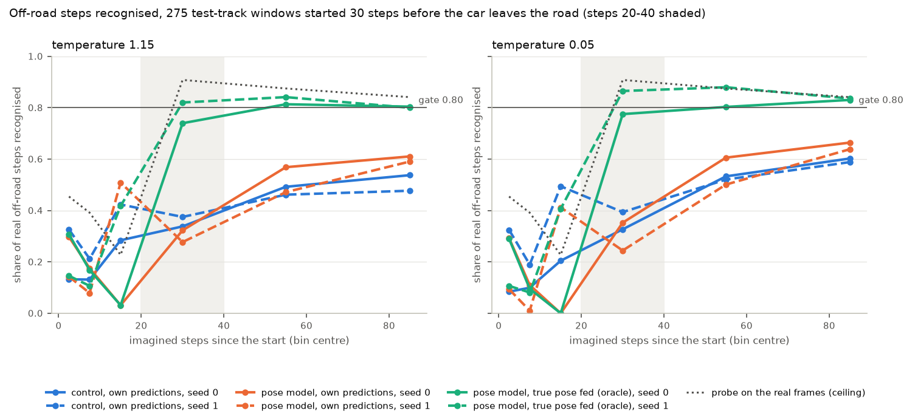
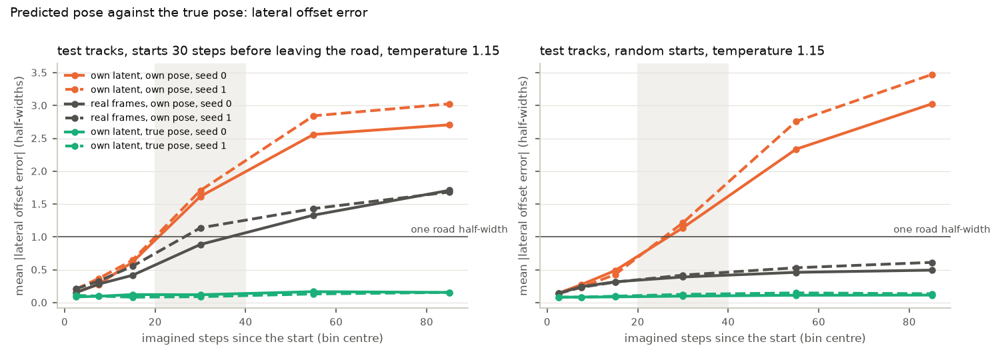

# A pose state for the world model (technical note 5.1, candidate 1): result

**Verdict: no.** Giving the world model the car's pose relative to the road (lateral offset,
heading error, speed), predicted with exact labels and fed back as an input, did not stop the drift.
The pre-registered gate (step 5) failed on all four criteria, at both temperatures. No controller was
trained (step 6 was not run).

On the 275 test-track windows that start 30 steps before the car leaves the road, the pose models
recognise 0.32 and 0.28 of real off-road steps at imagined steps 20-40. The no-pose controls
recognise 0.34 and 0.38. The gate required 0.80.

The pose input does carry the information. Fed the true pose at every step (the oracle), the same
models recognise 0.74 and 0.82. The model cannot keep its own predicted pose right: its
lateral-offset error passes one road half-width at about step 20 and reaches 1.6-1.7 half-widths by
steps 20-40. The drift has moved from the latent into the pose.

Two training seeds per configuration. Every threshold was fixed beforehand in
[preregistration.md](preregistration.md), and none was changed after results were seen.

## What was run

| Step | What | Outcome |
|---|---|---|
| 1 | Exact pose labels for the 1.36 M training steps (`ldr/label_pose.py`) | 1,400/1,400 replays match the recorded rewards; on-road flags identical to `latents_onroad.npy` on every step. AUC of \|lateral offset\| for the off-road flag 0.9999 |
| 2 | Pose head and pose input (`--pose-weight 1 --pose-input`), scheduled sampling of the pose fed back | Trained, seeds 0 and 1 |
| 3 | Oracle check, pose seed 0, validation windows | 0.82 >= 0.70: passed |
| 4 | Headline recipe with and without pose, seeds 0 and 1 | Four models, 20,000 steps each |
| 5 | State-tracking test and gate, test-track windows, tau 1.15 and 0.05 | **Failed** |
| 6 | Controllers, exploit gap, road disagreement, test IQM | Not run (gate failed) |

### Step 1: labels

`python -m ldr.label_pose` replays every episode from its track seed, as `ldr/label_road.py` does.
After every action it records:
- the signed lateral offset from the centre line, in road half-widths;
- the sin and cos of the heading error against the track tangent;
- the hull speed.

The nearest centre point is tracked step to step from the lap start. A global search takes over
only when it is closer by more than a half-width. The 1000 × 800 frame render is skipped: it does
not affect the physics, and the reward check above confirms the replay is unchanged. That cuts
labelling from about 84 minutes to 32 seconds.

Sanity check (`label_sanity.json`): |lateral offset| predicts the existing off-road flag with an AUC
of 0.9999, and of at least 0.9994 within each collection policy. A threshold of 1.34 half-widths
classifies 99.4% of steps correctly; the wheels reach beyond the hull centre, hence above 1.0. The
600 test-track rollouts used in step 5 were labelled the same way, and all 600 replays matched their
logged rewards and on-road flags.

### Step 2: model

The new features sit behind flags that default off:
- `ldr/mdnrnn.py` adds `pose_head` (LSTM output → pose after the action) and an optional pose input,
  making the input [z, a, q].
- `ldr/train_mdnrnn.py` adds `--pose-weight`, `--pose-input` and `--pose-ss-prob`. In training the
  pose fed is the true one, or with probability p the model's own prediction from the step before
  (detached, on its own coin, independent of the latent's). p ramps like `--ss-prob` to 0.3.
- `ldr/dream.py` carries the predicted pose through rollouts and teacher-forces the true pose
  through the warm-up.
- `ldr/check_dream.py` reads the pose configuration from a checkpoint's weights.

Old checkpoints load unchanged. Without the flags, outputs and training losses are bit-identical to
the code before this change (checked on `runs/mdnrnn`, `runs/mdnrnn_v1` and `runs/loop_head/r02`).
The controller is unchanged (input [z, h], 867 parameters). Tests: `tests/test_pose.py`, 8 tests
covering shapes, old-checkpoint loading, the fed-back pose in training and in the dream, and label
alignment. The whole suite passes (23 tests).

### Step 4: training

`python -m ldr.train_mdnrnn --steps 20000 --shared-mixture --ss-prob 0.3 --seed S`, plus
`--pose-weight 1 --pose-input` for the pose models. Same data (`data/latents.npz`), S = 0 and 1.
The four runs trained concurrently, 139 min each. The checkpoint used is `best.pt`, chosen by the
repository's existing rule (lowest validation loss on one 256-window batch).

| Model | Checkpoint step | Validation NLL | Validation reward MSE | Pose lateral error, teacher-forced |
|---|---|---|---|---|
| pose seed 0 | 18,000 | 0.977 | 0.691 | 0.045 half-widths |
| pose seed 1 | 18,000 | 0.985 | 0.697 | 0.048 half-widths |
| control seed 0 | 13,000 | 0.978 | 0.751 | - |
| control seed 1 | 5,000 | 0.994 | 0.726 | - |

Fed real inputs, the pose head is accurate: 0.05 half-widths of lateral error, against a road edge
at about 1.3. The pose did not cost latent likelihood.

## Step 5: state-tracking test

`diagnostics/pose_horizon.py` repeats `diagnostics/head_horizon.py` with pose conditions added:
- the same windows and the same independent road probe, rebuilt from head_horizon's random sequence;
- real actions replayed, 16 samples per window.

On the validation windows it reproduces head_horizon's published result for `runs/loop_head/r02`:
0.65 against 0.643 for off-road steps recognised at steps 20-40, and 0.87 against 0.876 for the
probe on real frames. Intervals are 95% bootstrap over windows. The test-track windows were
evaluated once per final checkpoint. Development used only the validation windows.

### Off-road steps recognised at steps 20-40 (275 test-track windows from 30 steps before the car leaves the road)

| Model | Fed | tau 1.15 | tau 0.05 |
|---|---|---|---|
| pose seed 0 | own latent, own pose | **0.32** [0.29, 0.36] | 0.35 [0.31, 0.40] |
| pose seed 1 | own latent, own pose | **0.28** [0.24, 0.32] | 0.24 [0.20, 0.29] |
| control seed 0 | own latent | **0.34** [0.30, 0.37] | 0.33 [0.28, 0.37] |
| control seed 1 | own latent | **0.38** [0.34, 0.41] | 0.39 [0.34, 0.44] |
| pose seed 0 | oracle: own latent, true pose | 0.74 [0.71, 0.77] | 0.78 [0.73, 0.81] |
| pose seed 1 | oracle: own latent, true pose | 0.82 [0.79, 0.85] | 0.87 [0.83, 0.90] |
| pose seed 0 | real frames, own pose | 0.78 [0.75, 0.81] | 0.82 [0.78, 0.85] |
| pose seed 1 | real frames, own pose | 0.83 [0.80, 0.85] | 0.86 [0.83, 0.89] |
| pose seeds 0 / 1 | real frames and true pose: one-step prediction | 0.88 / 0.90 | 0.92 / 0.93 |
| control seeds 0 / 1 | real frames: one-step prediction | 0.86 / 0.86 | 0.90 / 0.90 |
| - | the probe on the real frames (no model involved) | 0.91 [0.88, 0.93] | same |
| reference: headline model `runs/mdnrnn` | own latent | 0.40 [0.36, 0.44] | 0.39 [0.34, 0.44] |
| reference: `runs/loop_head/r02` (the note's 0.63) | own latent | 0.63 (published) | 0.69 [0.64, 0.73] |

The note's "0.91 when fed real frames" is the probe reading the real frames, so no model is
involved. The models' own one-step predictions from real frames read 0.86-0.93.



### The gate (tau 1.15; `gate.json`)

| Criterion, fixed beforehand | Result | Pass |
|---|---|---|
| 1. M >= 0.80 for every pose seed | 0.323, 0.277 | no |
| 2a. Mean pose minus mean control >= 0.10 | 0.300 − 0.356 = −0.057 | no |
| 2b. Lowest pose seed above highest control seed | 0.277 < 0.375 | no |
| 2c. Every paired 95% interval of pose minus control excludes zero, above it | seed 0: −0.015 [−0.048, +0.019]; seed 1: −0.098 [−0.135, −0.059] | no |

At tau 0.05 the gate also fails every criterion (`gate_tau0.05.json`): the pose models give 0.35 and
0.24, the controls 0.33 and 0.39, and the paired differences are +0.026 [−0.022, +0.074] and −0.150
[−0.199, −0.098]. Seed 1's pose model is worse than its control at both temperatures, with intervals
that exclude zero.

### Road-status accuracy on random starts (fed own predictions)

| Model | Test tracks (1,800 windows), steps 20-40 | Steps 70-100 | Validation (210 windows), steps 20-40 | Steps 70-100 |
|---|---|---|---|---|
| pose seed 0 | 0.67 [0.66, 0.68] | 0.35 [0.33, 0.36] | 0.94 [0.93, 0.96] | 0.82 [0.79, 0.85] |
| pose seed 1 | 0.63 [0.62, 0.65] | 0.33 [0.31, 0.35] | 0.94 [0.92, 0.95] | 0.83 [0.80, 0.86] |
| control seed 0 | 0.81 [0.80, 0.82] | 0.46 [0.45, 0.48] | 0.94 [0.93, 0.96] | 0.84 [0.81, 0.87] |
| control seed 1 | 0.79 [0.78, 0.80] | 0.37 [0.35, 0.38] | 0.93 [0.90, 0.94] | 0.84 [0.81, 0.86] |
| reference: headline | 0.88 [0.87, 0.89] | 0.45 [0.44, 0.47] | 0.94 [0.93, 0.96] | 0.83 [0.81, 0.86] |

These figures are at tau 1.15. The tau 0.05 values are in [tables.md](tables.md).

On the test tracks, where the drivers stay on the road 87% of the time, the pose models are less
accurate than the controls at steps 20-40: 0.63-0.67 against 0.79-0.81.

### Pose error against horizon (tau 1.15)

Lateral offset error in half-widths, at steps 20-40:

| Fed | Windows before a departure | Random starts |
|---|---|---|
| own latent, own pose | 1.62 / 1.71 | 1.14 / 1.22 |
| real frames, own pose | 0.88 / 1.14 | 0.39 / 0.42 |
| own latent, true pose (oracle) | 0.12 / 0.09 | 0.10 / 0.12 |

Heading error on own predictions is 37-40° before a departure and 32-38° on random starts at steps
20-40; it reaches 57-88° by steps 70-100. Off-road rate implied by the predicted offset
(|offset| > 1.34), against the true off-road share, at steps 20-40:

| Fed | Windows before a departure | Random starts |
|---|---|---|
| own predictions | 0.27 / 0.24 against 0.55 | 0.46 / 0.44 against 0.13 |

So the predicted pose misses the real departures, and on random starts it puts the car off the road
far more often than it is. The pose models' lower latent-probe accuracy on random starts is
consistent with that, though the link was not tested directly. Full per-bin values are in
[tables.md](tables.md).



### Temperature

Lowering the temperature from 1.15 to 0.05 changes M by at most 0.04 for the controls and the
headline model, and by −0.04 to +0.03 for the pose models. For the note's model it moves from 0.63
to 0.69. Sampling noise therefore accounts for little of the drift; most of it remains with
near-deterministic sampling.

## What it implies

1. **The hypothesis behind candidate 1 holds, but this implementation does not deliver it.** Told
   where the car is, the model's imagined frames show the car off the road when it is: oracle
   0.74-0.82 on test, 0.82-0.84 on validation, near the probe's ceiling of 0.91. The failure is in
   predicting the pose, not in using it.
2. **The pose is lost on the same horizon as the latent, and more so before a departure.** With
   real frames but its own pose, the error before a departure still grows to 0.9-1.1 half-widths by
   steps 20-40, against 0.4 on random starts. The model does not correct its pose from the frames
   it is given at the moments that matter. Fed its own frames as well, the pose drifts like the
   latent did.
3. **No reduction relative to the no-pose control.** Within seeds the pose models are equal (seed 0)
   or worse (seed 1) on the primary measure, and worse on random-start accuracy on the test tracks.
4. **The starting point is lower than the note's 0.63.** Retrained from scratch with the headline
   recipe, the no-pose models score 0.34-0.40 on these windows. The note's 0.63 belongs to the
   model after the repair-loop rounds and the on-road output (note 3.8). Which of those accounts
   for the difference was not tested.
5. **Validation and test disagree in level.** On the 52 validation windows (the data-collection
   policies' own driving) every model scores 0.64-0.75. On the 275 test windows (the runs of
   dream-trained drivers) they score 0.24-0.40. The gate used the test windows, as fixed beforehand.

Not tested, and not claimed: whether a higher probability of feeding the predicted pose in training,
longer training windows on the model's own pose, or a pose advanced by known kinematics instead of a
learned head would hold the pose. Candidate 2 (a road map around the car) was not started.

## Caveats

- Two seeds per configuration, one setting (pose weight 1, pose scheduled sampling 0.3). A different
  setting could behave differently. The gate's result is unambiguous at this setting: the best
  pose seed is 0.48 below the 0.80 threshold.
- Control seed 1's checkpoint comes from step 5,000 under the repository's selection rule. Its last
  checkpoint was checked on the validation windows only: 0.74 against 0.64 for `best.pt`, so the
  selection, if anything, understates that control.
- Reference models were measured on the test windows once each, and `runs/loop_head/r02` only at
  tau 0.05, its 1.15 value being already published.

## Reproduction

```bash
python -m ldr.label_pose --workers 6                                  # labels, ~30 s
python -m ldr.label_pose --workers 3 --rollouts data/dream_failure/rollouts_loop_{head,road}_r02_p{0,1,2}.npz
python -m ldr.train_mdnrnn --steps 20000 --shared-mixture --ss-prob 0.3 --pose-weight 1 --pose-input \
    --seed S --out runs/pose_state/pose_sS                            # S = 0, 1
python -m ldr.train_mdnrnn --steps 20000 --shared-mixture --ss-prob 0.3 --seed S --out runs/pose_state/ctrl_sS
cd diagnostics
python pose_horizon.py --model ../runs/pose_state/NAME/best.pt --name NAME --sets val test --tau 1.15 0.05
python pose_gate.py --pose pose_s0 pose_s1 --control ctrl_s0 ctrl_s1 [--tau 0.05]
python pose_report.py                                                 # tables.md, summary.json, figures
```

Files: `preregistration.md` (thresholds), `label_sanity.json`, `label_pose.log`, `gate.json`,
`gate_tau0.05.json`, `summary.json`, `tables.md`, and `horizon/` (per-model json with intervals,
per-window counts in npz, logs). Checkpoints are in `runs/pose_state/`.
