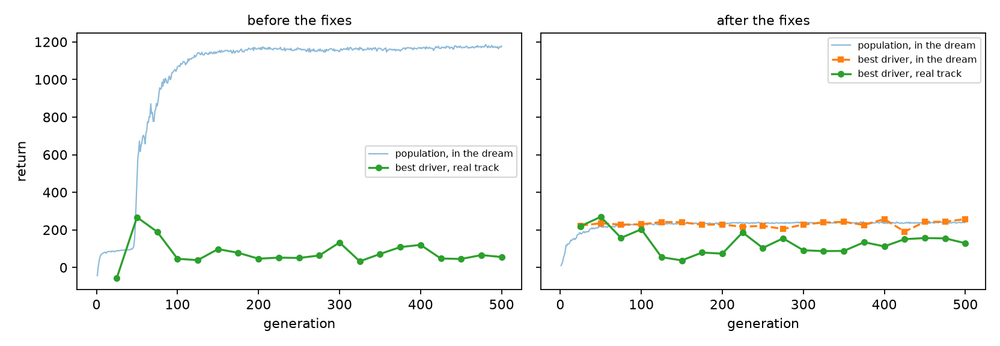
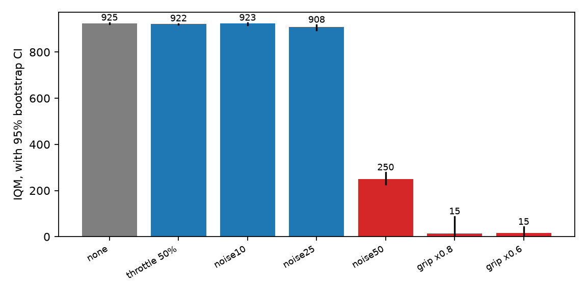
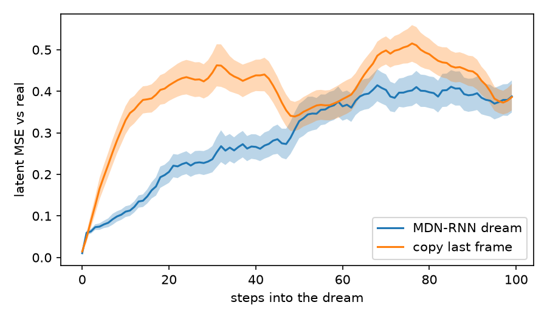

# Why controllers trained inside a learned world model fail on CarRacing-v3: a diagnosis

| | |
|---|---|
| **Author** | Jordan Bonil |
| **Report reference** | LDR-TN-01 (repository tag `v1.0-tn01`, commit `dd99005`) |
| **Date** | 30 September 2026 |
| **Repository** | lucid-dream-racer |
| **Figures generated from** | runs/controller_v2, runs/dream_v3, runs/mdnrnn (v2) |

---

## Summary

This report asks why a controller trained entirely inside a learned world model [1] fails to drive well on the Gymnasium CarRacing-v3 environment, where the original paper trained its controller in the real simulator.

Trained in the simulator, the controller reproduces [1]: a mean return of 908.4 (sd 68.0) over 100 unseen tracks, against the 906 (sd 21) reported. Trained inside the model, it reaches a mean of 251.7 (sd 184.8).

The cause is the model's fidelity when a controller drives it in closed loop. Over the ten controllers with a positive real return (a rule fixed before the dream scores were examined), the first model ranked drivers close to the reverse of the simulator's order: rank correlation −0.75 (p = 0.013); over all twelve it was indistinguishable from zero. Reward-head inaccuracy, imagined states leaving the training data, sampling temperature and rollout length were each tested and rejected.

Three changes were applied together: on-policy data, one mixture component per frame, and scheduled sampling. The model's valuation of competent driving rose from 6% to 53% of its true worth, but the improvement in ranking is not statistically significant (+0.20, p = 0.747, n = 5; +0.44, p = 0.152 over all twelve), and each configuration used one seed. The repaired model values gross driving errors correctly but does not separate competent drivers from slightly better ones, which an evolutionary search requires.

---

## 1. Introduction

### 1.1 Scope

The World Models architecture [1] separates an agent into three parts trained in sequence:
a variational autoencoder for vision, a recurrent mixture-density network for dynamics and
memory, and a small controller. For CarRacing, [1] trains the controller in the real
simulator. Training inside the learned model is demonstrated on VizDoom only.

This report asks whether the same architecture supports controller training inside the
model on CarRacing, and, if it does not, identifies what fails. No model-free baseline was
run, so the comparison is between two ways of training the same architecture, not against
PPO or SAC.

### 1.2 Intended reader

The report assumes familiarity with reinforcement learning terminology and with [1]. It
does not assume familiarity with this implementation. Full numerical detail of the
diagnostic procedures is placed in Appendix A, and implementation and cost detail in
Appendices B and C.

---

## 2. Procedure

### 2.1 Architecture

The vision model is a convolutional variational autoencoder mapping a 64 × 64 × 3 frame to
32 latent dimensions, trained with a free-nats floor of 0.5 nats per dimension. The
dynamics model is an LSTM with 256 hidden units and a mixture-density head over the next
latent, with additional scalar heads for reward and termination. The controller is an
affine map from the 288 concatenated vision and memory outputs to three actions, giving
867 parameters.

Vision and dynamics are frozen before the controller is trained. The controller is
optimised by CMA-ES, because the simulator is not differentiable and the tile-visit reward
is piecewise constant in position.

### 2.2 Data

1,400 episodes were recorded, totalling 1.36 million frames: 500 from a noisy pure-pursuit
driver using privileged track geometry, 500 from a temporally correlated random driver,
and 400 collected on-policy from the trained controller with added action noise. The
on-policy episodes were added after the first round of results, as described in 3.4.

### 2.3 Evaluation protocol

Seed ranges are disjoint across stages. Data collection uses seeds 0–1,399, controller
training 100,000 upward, validation 900,000 upward, and the test set 1,000,000–1,000,099.
The test set was evaluated once per final checkpoint.

Results are reported as the interquartile mean with a 95% percentile bootstrap interval
over 5,000 resamples, because per-track returns are strongly bimodal: a controller either
completes a track or fails on it. The IQM is used for comparisons internal to this report,
where no external convention has to be matched; a comparison against a source that reports
a mean, such as [1] in 3.1, is made mean to mean instead, since the two statistics are not
interchangeable.

---

## 3. Findings

### 3.1 Controller trained in the simulator

Table 3.1 gives the result on the 100-track test set.

**Table 3.1 — Test-set performance (100 tracks)**

| Controller trained | IQM [95% CI] | Mean (sd) |
|---|---|---|
| In the simulator | 924.8 [922.1, 926.5] | 908.4 (68.0) |
| In the learned model | 209.6 [176.7, 248.7] | 251.7 (184.8) |

The interval on the simulator-trained controller is 4.4 points wide against a per-track
standard deviation of 68. The controller therefore handles the middle half of tracks
almost identically, and the lower mean reflects a small number of outright failures.
Compared mean to mean, the standard the original paper reports in, 908.4 (sd 68.0) against
the 906 (sd 21) in [1], the simulator-trained controller reproduces [1]; the wider spread
here reflects the same small number of outright failures.

### 3.2 First attempt at training inside the model

Dream fitness rose to 1,175 over 1,000 imagined steps. The environment cannot return more
than 1,000, since the return is bounded by 1000c − 0.1T with c ≤ 1. Real-track performance
of the same controller peaked at 265 near generation 50 and then declined for the
remaining 450 generations. Figure 3.1, left panel, shows both curves. The point at which
they separate coincides with the dream score crossing the environment's ceiling.

**Figure 3.1 — Dream score and real-track return during controller evolution, before
(left) and after (right) the changes described in 3.4**



### 3.3 Diagnosis

The decisive measurement was rank correlation. Twelve controllers spanning competent to
broken were scored both inside the model and in the simulator, using the pre-fix
predictor. Two are inactive in both settings and score near zero, which mutes the
correlation; the rule applied throughout this report, fixed on the real score before the
dream scores are examined, is to report the correlation both over all twelve and over the
subset with a positive real return. Over all twelve, Spearman's rank correlation between
the two was indistinguishable from zero (ρ = −0.01, p = 0.983, n = 12). Restricted to the
ten controllers with a positive real return, the model preferred the controllers the
simulator penalised (ρ = −0.75, p = 0.013, n = 10).

Five candidate causes were tested and rejected. Full procedures and figures are in
Appendix A; the outcomes are summarised in Table 3.2.

**Table 3.2 — Candidate causes tested**

| Candidate cause | Test | Outcome |
|---|---|---|
| Reward head inaccurate | Teacher-forced prediction on real states | Rejected: 618 predicted against 672 true |
| Reward head ranking | Same test, two controllers | Rejected: 618 against 168, correct order |
| Imagined states leave the data | Mahalanobis distance to the latent distribution | Rejected: apparent drift was a measurement artefact (3.3.1) |
| Sampling temperature | Repeat at τ = 0.05 | Rejected: correlation unchanged |
| Rollout length | Reduce from 1,000 to 200 steps | Rejected: impossible scores removed, transfer unchanged |

### 3.3.1 The latent-distance artefact

Imagined latents initially appeared to sit 350 Mahalanobis units from the recorded latent
distribution, suggesting imagination was leaving the data manifold. Two errors produced
that figure. First, sampled latents were compared against a reference built from posterior
means; a reference built from sampled real latents sits at 323, accounting for almost all
of the apparent distance. Second, about half of the 32 latent dimensions are inactive,
with std(μ) ≈ 0.01 against σ ≈ 1; the Mahalanobis metric divides by the variance of μ, so
those dimensions dominate the measurement while carrying no information about the frame.
Both errors independently produce a confident false conclusion, which is why this
diagnostic is reported here rather than left in the appendix.

What remained was closed-loop fidelity. Replaying a recorded sequence of competent actions
open-loop, with no controller in the loop, the model valued 411 points of real driving at
25.6. The latent error after 100 imagined steps was 1.2 against a signal variance of 0.28,
indicating no remaining correlation with the real trajectory.

### 3.4 Effect of the three changes

Three changes were applied in one retraining: 400 on-policy episodes added to the dataset,
one mixture component drawn per frame instead of independently per latent dimension, and
scheduled sampling at a final probability of 0.3, ramped over the first half of training.

**Table 3.3 — Before and after the three changes**

The two rank-correlation rows below report the same two quantities for both before and
after: all twelve controllers, and the subset kept by one rule — a positive real-world
return — decided before the dream scores are examined. The subset's size differs between
before and after because it depends on the real-world return, and the repaired predictor
changes the controller's own hidden-state features, not only its dream score (2.1); it is
not a free choice made to flatter either column.

| Measure | Before | After |
|---|---|---|
| Rank correlation, all 12 controllers | ρ = −0.01 (p = 0.983, n = 12) | ρ = +0.44 (p = 0.152, n = 12) |
| Rank correlation, real return ≥ 0 | ρ = −0.75 (p = 0.013, n = 10) | ρ = +0.20 (p = 0.747, n = 5) |
| Predicted / true reward, open-loop replay | 0.06 | 0.53 |
| Model-trained controller, test IQM | 295.1 [269.2, 321.2] | 209.6 [176.7, 248.7] |

Per-episode reward correlation and the simulator-trained controller's test IQM were not
measured for the pre-fix predictor and controller, and are not reconstructable without a
retraining run outside the scope of this revision; they are omitted here rather than shown
as unmeasured placeholders.

The reward-head valuation of competent driving improved clearly (6% to 53%), and the
model-trained controller's test IQM improved by a small margin. The rank-correlation
evidence is weaker: the significant negative correlation over the positive-return subset
became a small positive correlation that is not itself statistically significant (p =
0.747, n = 5); over all twelve controllers it moved from indistinguishable from zero to a
positive but still non-significant value (p = 0.152). The three changes improved the
model's valuation of good driving and its transfer, but do not establish, at conventional
significance, that the repaired model ranks these controllers correctly.

### 3.5 Residual limitation

Figure 3.1, right panel, identifies the remaining failure. The dream score of the best
controller is flat at approximately 230 from generation 25 onward, while its real-track
return falls from 270 to 40 over the same interval. The search reaches the coarse optimum
within 50 generations and then has no signal to follow.

The model is not indiscriminately generous. Holding a constant input for 100 steps, it
pays 37.2 for straight-ahead driving and between 0.2 and 4.7 for locked steering, against
34.1 and 1.0 to 2.7 respectively in the simulator (Appendix A.3). It represents the gross
consequences of control input correctly. It does not resolve the differences between two
competent racing lines.

### 3.6 Robustness of the simulator-trained controller

**Table 3.4 — Test-set IQM under perturbation (100 tracks each)**

| Perturbation | IQM | Change |
|---|---|---|
| None | 924.8 | — |
| Throttle capped at 50% | 921.6 | −0.3% |
| Pixel noise, σ = 10 | 923.5 | −0.1% |
| Pixel noise, σ = 25 | 907.9 | −1.8% |
| Pixel noise, σ = 50 | 250.4 | −73% |
| Road friction × 0.8 | 14.7 | −98% |
| Road friction × 0.6 | 15.3 | −98% |

**Figure 3.2 — Test-set IQM under perturbation**



Visual robustness degrades gradually and then collapses between σ = 25 and σ = 50.
Friction shows no gradient: a 20% reduction is as damaging as a 40% reduction.

A single episode explains the discontinuity. At full friction the controller returns 922.9
in 771 steps. At 0.8 it returns −3.7 over the full 1,000 steps. The car understeers at the
first corner, spins, and stops. The controller is deterministic, so a stationary car facing
away from the track produces zero throttle, which reproduces the same observation, which
again produces zero throttle. The closed loop enters an absorbing state and remains there.

---

## 4. Conclusions

4.1 A controller trained in the simulator on frozen vision and memory features reaches
924.8 IQM on 100 unseen tracks, reproducing [1].

4.2 The same controller architecture trained inside the learned model reaches 209.6 IQM.
The gap is not attributable to the reward head, to imagined states leaving the training
distribution, to sampling temperature, or to rollout length, all of which were tested.

4.3 The cause is closed-loop fidelity. Before correction, restricted to the controllers
with a positive real-world return, the model ordered controllers close to reverse (ρ =
−0.75, p = 0.013, n = 10) and valued competent driving at 6% of its worth.

4.4 On-policy data, a shared mixture component and scheduled sampling raise that
correlation to a small positive value that is not itself statistically significant (ρ =
+0.20, p = 0.747, n = 5; ρ = +0.44, p = 0.152, over all twelve controllers), and raise the
valuation to 53%. They improve the model's treatment of good driving but do not
demonstrate, at conventional significance, a repaired ranking ability, and they do not
close the performance gap.

4.5 The corrected model discriminates between competent and incompetent control, and not
between competent and marginally better control. An evolutionary search requires the
second discrimination, which is why 450 of 500 generations produce no improvement.

4.6 The simulator-trained controller is insensitive to reduced throttle and to moderate
visual noise, and fails completely under a 20% reduction in road friction. The failure is
an absorbing state created by the determinism of the policy, not a gradual loss of skill.

---

## 5. Recommendations

**Limitation.** Every configuration in this report — before and after the changes in 3.4 —
was trained with a single seed. The before/after comparison in 3.4 therefore rests on n =
1 per side, and a difference of this size is also consistent with seed variance alone;
recommendation 5.1 exists to address this.

5.1 Attribute the three changes individually. Three retrainings scored by rank correlation
alone would establish which is responsible, at approximately one hour each, and would not
require the controller to be retrained.

5.2 Measure discrimination separately from ordering. The rank test should be repeated over
controllers that are all competent, since the coarse test overstates the model's
usefulness for search.

5.3 Address the absorbing state before any deployment claim, either by adding a stochastic
component to the policy or by including recovery states in controller training.

5.4 Compare against an architecture designed for this failure. DreamerV3 [2] replaces
staged training with joint learning, discrete latents, and gradients through short
imagined rollouts.

---

## 6. References

**1.** Ha, D. and Schmidhuber, J. (2018). World Models. *Advances in Neural Information
Processing Systems 31*. [online] Available at https://arxiv.org/abs/1803.10122
[Accessed 30 Sep. 2026].

**2.** Hafner, D., Pasukonis, J., Ba, J. and Lillicrap, T. (2023). Mastering Diverse Domains
through World Models. [online] Available at https://arxiv.org/abs/2301.04104
[Accessed 30 Sep. 2026].

**3.** Towers, M. et al. (2024). Gymnasium: A Standard Interface for Reinforcement Learning
Environments. [online] Available at https://arxiv.org/abs/2407.17032
[Accessed 30 Sep. 2026].

**4.** Hansen, N. (2016). The CMA Evolution Strategy: A Tutorial. [online] Available at
https://arxiv.org/abs/1604.00772 [Accessed 30 Sep. 2026].

**5.** Agarwal, R. et al. (2021). Deep Reinforcement Learning at the Edge of the Statistical
Precipice. *Advances in Neural Information Processing Systems 34*. [online] Available at
https://arxiv.org/abs/2108.13264 [Accessed 30 Sep. 2026].

---

## Appendix A — Diagnostic procedures

### A.1 Rank correlation

Twelve controllers were constructed by shrinking and perturbing the final CMA-ES
distribution means of both training runs, giving a spread from competent to inactive. Each
was scored inside the model over 16 imagined rollouts of 200 steps, repeated with five
random seeds to establish a noise floor, and in the simulator over eight validation tracks
(`diagnostics/rank_check.py`, `reports/rank_before.json`, `reports/rank_after.json`).

Two of the twelve are inactive controllers scoring near zero in both, and they mute the
correlation by agreeing trivially near zero. Rather than drop them after the fact, the same
rule — keep controllers with a positive real-world return — is applied to both conditions,
decided on the real score before the dream scores are examined, and both the full set and
the resulting subset are reported (Table 3.3). Before the changes of 3.4: ρ = −0.01 (p
= 0.983, n = 12) over all twelve, ρ = −0.75 (p = 0.013, n = 10) over the subset. After: ρ =
+0.44 (p = 0.152, n = 12) over all twelve, ρ = +0.20 (p = 0.747, n = 5) over the subset.
The subset is smaller after the changes because fewer of the same twelve controllers keep
a positive real-world return once the repaired predictor is driving the controller's own
hidden state, not only its dream score.

### A.2 The latent-distance artefact

See 3.3.1: promoted to the main text, since it is the strongest evidence of diagnostic
discipline in this report.

### A.3 Steering-consequence test

A constant control input was held for 100 steps from a mid-track state, in the model and in
the simulator.

**Table A.1 — Return over 100 steps under constant input**

| Input | Model | Simulator |
|---|---|---|
| Straight ahead | 37.2 | 34.1 |
| Half left | 0.2 | 1.0 |
| Full left | 1.7 | 1.0 |
| Full right | 4.7 | 2.7 |

The model reproduces the simulator's treatment of gross control error. This rules out the
hypothesis that the model regenerates road beneath the vehicle regardless of input.

### A.4 Open-loop prediction quality

**Figure A.1 — Latent error against a copy-last-frame baseline over 100 imagined steps**



Measured at τ = 0.05 to remove sampling noise from the comparison. At τ = 1.15 the
comparison is dominated by the width of the mixture rather than by prediction error.

---

## Appendix B — Computational cost

All work ran on one Apple Silicon laptop with four performance cores, four efficiency
cores and one integrated GPU.

Profiling a controller rollout attributes 83% of wall time to the simulator, and 97% of
that to the rendering of a 1000 × 800 surface which is then downsampled to 64 × 64.
Batching the neural networks on the GPU is therefore bounded by Amdahl's law at
approximately 1.2 ×, and was not implemented.

**Table B.1 — Effect of the changes that were implemented**

| Change | Effect |
|---|---|
| One rollout per task, dispatched dynamically | Removes idle time on fast cores |
| Racing: one track, then the better half | 128 → 80 rollouts per generation |
| Six workers rather than eight | 96% of throughput, two cores released |
| Combined | 235 → 142 s per generation |

Controller training in the simulator took 11 h 50 min for 300 generations. Controller
training inside the model took approximately 20 minutes for 500 generations.

---

## Appendix C — Reproduction

```bash
pip install -e ".[app,baseline,dev]"
bash scripts/run_all.sh
```

`scripts/run_all.sh` runs both training rounds described in 2.2 and 3.4 in sequence: the
first round on pursuit and Brownian data only, producing the pre-fix predictor and
controllers; then, after adding 400 on-policy episodes, a retraining with
`--shared-mixture`, `--ss-prob 0.3` and `--race` that produces the checkpoints this report
draws its headline numbers from. The rank-correlation diagnostic (3.3, Table 3.3, A.1)
needs the pre-fix predictor back in place temporarily; the exact commands are given as
comments at the end of the script.

Diagnostics referenced in Appendix A are in `diagnostics/`, and figures are regenerated by
`python diagnostics/make_figures.py`. Checkpoints, logs and per-track evaluation records
are under `runs/` and `reports/`.

**Table C.1 — Source of each reported figure and table**

| Figure / table | Run folder(s) | Report file(s) |
|---|---|---|
| Table 3.1, Figure A.1 | runs/controller_v2, runs/dream_v3, runs/mdnrnn | reports/eval_wm_real_v2.json, reports/eval_wm_dream_v3.json, reports/dream_check.png |
| Figure 3.1 (fig1_transfer.png) | runs/dream_controller (before), runs/dream_v3 (after) | runs/dream_controller/log.csv, runs/dream_v3/log.csv |
| Table 3.2, 3.3.1 | runs/mdnrnn | diagnostics/drift_check.py, diagnostics/drift_check2.py, diagnostics/reward_check.py |
| Table 3.3, A.1 | runs/controller, runs/dream_v2 (controllers scored); runs/mdnrnn_v1 (before), runs/mdnrnn (after) | reports/rank_before.json, reports/rank_after.json, reports/eval_wm_dream_v1.json, reports/eval_wm_dream_v3.json |
| Table 3.4, Figure 3.2 (fig4_robustness.png) | runs/controller_v2 | reports/eval_wm_real_v2*.json |
| Appendix B | runs/controller, runs/controller_v2 | runs/controller/log.csv, runs/controller_v2/log.csv |
