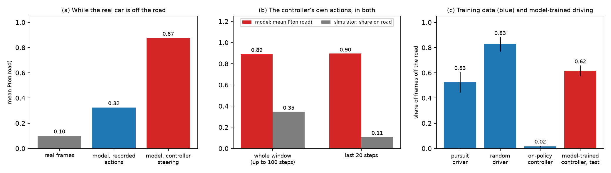
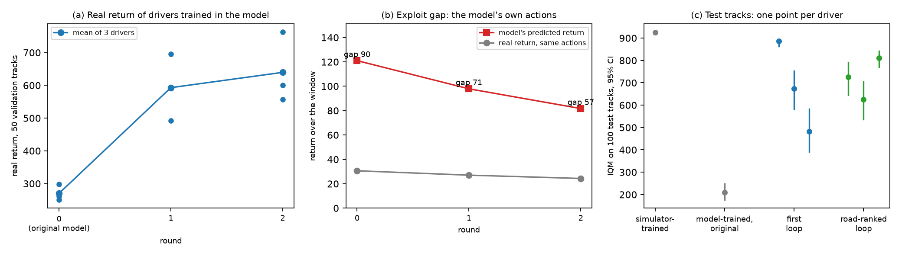
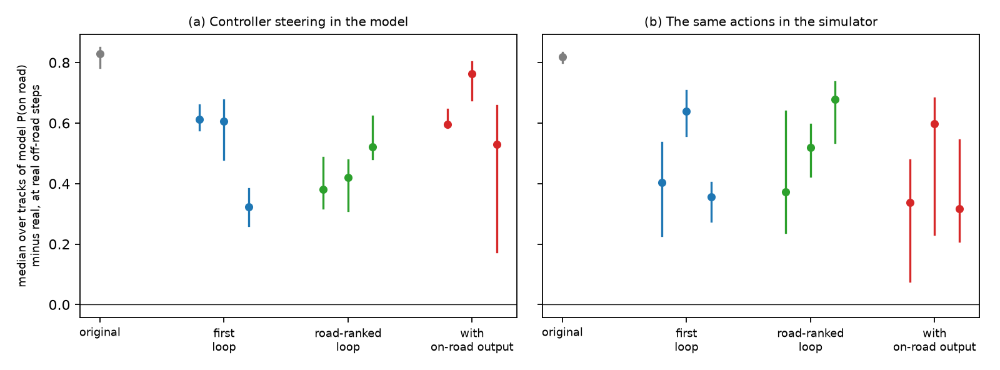
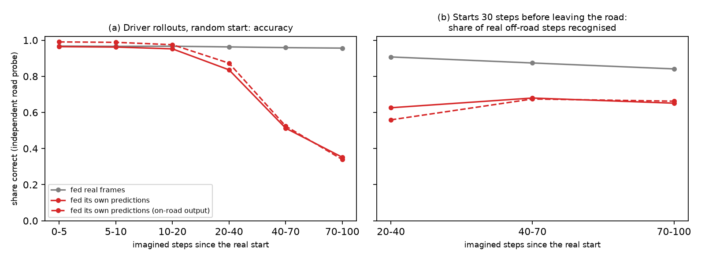
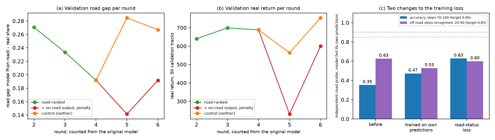

# Training a CarRacing-v3 driver inside a learned world model: exploitation, drift and a partial repair

| | |
|---|---|
| **Author** | Jordan Bonil |
| **Report reference** | LDR-TN-01, issue 2 (repository tag `v1.1-tn01`; issue 1: tag `v1.0-tn01`) |
| **Date** | 5 October 2026 |
| **Repository** | lucid-dream-racer |
| **Figures generated from** | runs/controller_v2, runs/dream_v3, runs/mdnrnn (v2), runs/loop, runs/loop_road, runs/loop_head, runs/loop_ctrl, runs/ft_free, runs/ft_probe |

---

## Summary

This report asks whether the World Models architecture [1] can train a CarRacing-v3 driver inside its own learned model, as [1] does for VizDoom, and what fails when it cannot.

Trained in the simulator, the controller reproduces [1]: a mean return of 908.4 (sd 68.0) over 100 unseen tracks, against the 906 (sd 21) reported. Trained inside the model, it reaches 251.7 (IQM 209.6).

The model is not uniformly inaccurate; it is exploited. Started 30 steps before the car leaves the road and steered by the controller, it gives a mean probability of 0.89 that the car is on the road over the next 100 steps; the same actions keep the real car on the road 35% of the time. In the latest model, the state follows reality for about 20 imagined steps, then drifts: between steps 20 and 40 it recognises 63% of real off-road steps, against 91% when fed real frames.

A repair loop that replays the model's chosen actions in the simulator and fine-tunes on its largest errors raised the test IQM of model-trained drivers from 209.6 to 710.3 [652.3, 761.2] in two rounds. The road-status disagreement fell but remained for all nine drivers tested. Four further changes aimed at road status, to the data, the outputs and the training loss, did not reduce it. Each loop result rests on one run of three drivers.

The evidence points to a model state that does not track the car relative to the road; a state that does, and replication over seeds, are recommended.

---

## 1. Introduction

### 1.1 Scope

The World Models architecture [1] separates an agent into three parts trained in sequence:
a variational autoencoder for vision, a recurrent mixture-density network for dynamics and
memory, and a small controller. For CarRacing, [1] trains the controller in the real
simulator. Training inside the learned model is demonstrated on VizDoom only.

This report asks whether the same architecture supports controller training inside the
model on CarRacing, identifies what fails, and measures how far a repair that feeds real
outcomes back into the model goes. No model-free baseline was run, so the comparison is
between ways of training the same architecture, not against PPO or SAC.

Issue 1 of this report attributed the failure to closed-loop fidelity and concluded that the
model values gross control errors correctly (3.5). Issue 2 shows that this holds for constant
inputs only: under the controller's own steering the model is systematically too forgiving
(3.5). It adds the repair loop (3.6), its effect on road status (3.7), where the model loses
the road (3.8), and four changes that did not help (3.9).

### 1.2 Intended reader

The report assumes familiarity with reinforcement learning terminology and with [1]. It
does not assume familiarity with this implementation. Full numerical detail of the
diagnostic procedures is placed in Appendix A, and implementation and cost detail in
Appendices B and C.

---

## 2. Procedure

### 2.1 Architecture

The vision model is a convolutional variational autoencoder mapping a 64 × 64 × 3 frame to
32 latent dimensions, trained with a free-nats floor of 0.5 nats per dimension. The
dynamics model is an LSTM with 256 hidden units and a mixture-density head over the next
latent, with additional scalar heads for reward and termination. The controller is an
affine map from the 288 concatenated vision and memory outputs to three actions, giving
867 parameters.

Vision and dynamics are frozen before the controller is trained. The controller is
optimised by CMA-ES [4], because the simulator is not differentiable and the tile-visit
reward is piecewise constant in position. Because the controller reads the model's memory,
a controller is always run with the model it was trained in.

### 2.2 Data

1,400 episodes were recorded, totalling 1.36 million frames: 500 from a noisy pure-pursuit
driver using privileged track geometry, 500 from a temporally correlated random driver,
and 400 collected on-policy from the trained controller with added action noise. The
on-policy episodes were added after the first round of results, as described in 3.4.

Every recorded episode is reproduced exactly by replaying its actions from its track seed;
all 1,400 replays matched the recorded rewards. The replay gives the true road status after
every action, used from 3.7 onward: 45.1% of the 1.36 million steps are off the road.

### 2.3 Evaluation protocol

Seed ranges are disjoint across stages. Data collection uses seeds 0–1,399, controller
training 100,000 upward, validation 900,000 upward, and the test set 1,000,000–1,000,099.
The test set was evaluated once per final checkpoint. The repair loop (3.6) collects data on
training tracks and measures on validation tracks 900,100–900,149; it never uses the test set.

Results are reported as the interquartile mean with a 95% percentile bootstrap interval
over 5,000 resamples, because per-track returns are strongly bimodal: a controller either
completes a track or fails on it. The IQM is used for comparisons internal to this report,
where no external convention has to be matched; a comparison against a source that reports
a mean, such as [1] in 3.1, is made mean to mean instead, since the two statistics are not
interchangeable. Validation measurements inside the loop are means over three drivers and
50 tracks.

### 2.4 Measurements added in issue 2

**On the road.** A wheel touches a road tile. An excursion is 20 or more consecutive
off-road steps.

**Road probe.** A small classifier reading P(on road) from a latent, trained on real latents
with the true labels. It reads real latents with an area under the ROC curve of 0.99. It is
used to read road status from imagined latents, which have no label of their own.

**Closed-loop test.** On each test track, the model is started in the exact real state 30
steps before the car first leaves the road, and the controller steers inside it for up to
100 steps. The reported quantity is the median over tracks of P(on road) in the model minus
P(on road) from the real frames, over the steps at which the real car is off the road. Zero
would be agreement.

**Same actions in the simulator.** The actions the controller chose inside the model are run
in the simulator from the same real state, and the same difference is computed against the
frames the simulator produces.

**Exploit gap.** Over the same windows, the model's predicted return minus the real return
of the same actions.

Procedures are in Appendix A.5–A.8.

---

## 3. Findings

### 3.1 Controller trained in the simulator

Table 3.1 gives the result on the 100-track test set.

**Table 3.1 — Test-set performance (100 tracks)**

| Controller trained | IQM [95% CI] | Mean (sd) |
|---|---|---|
| In the simulator | 924.8 [922.1, 926.5] | 908.4 (68.0) |
| In the learned model | 209.6 [176.7, 248.7] | 251.7 (184.8) |

The interval on the simulator-trained controller is 4.4 points wide against a per-track
standard deviation of 68. The controller therefore handles the middle half of tracks
almost identically, and the lower mean reflects a small number of outright failures.
Compared mean to mean, the standard the original paper reports in, 908.4 (sd 68.0) against
the 906 (sd 21) in [1], the simulator-trained controller reproduces [1]; the wider spread
here reflects the same small number of outright failures.

### 3.2 First attempt at training inside the model

Dream fitness rose to 1,175 over 1,000 imagined steps. The environment cannot return more
than 1,000, since the return is bounded by 1000c − 0.1T with c ≤ 1. Real-track performance
of the same controller peaked at 265 near generation 50 and then declined for the
remaining 450 generations. Figure 3.1, left panel, shows both curves. The point at which
they separate coincides with the dream score crossing the environment's ceiling.

**Figure 3.1 — Dream score and real-track return during controller evolution, before
(left) and after (right) the changes described in 3.4**


### 3.3 Diagnosis

The decisive measurement was rank correlation. Twelve controllers spanning competent to
broken were scored both inside the model and in the simulator, using the pre-fix
predictor. Two are inactive in both settings and score near zero, which mutes the
correlation; the rule applied throughout this report, fixed on the real score before the
dream scores are examined, is to report the correlation both over all twelve and over the
subset with a positive real return. Over all twelve, Spearman's rank correlation between
the two was indistinguishable from zero (ρ = −0.01, p = 0.983, n = 12). Restricted to the
ten controllers with a positive real return, the model preferred the controllers the
simulator penalised (ρ = −0.75, p = 0.013, n = 10).

Five candidate causes were tested and rejected. Full procedures and figures are in
Appendix A; the outcomes are summarised in Table 3.2.

**Table 3.2 — Candidate causes tested**

| Candidate cause | Test | Outcome |
|---|---|---|
| Reward head inaccurate | Teacher-forced prediction on real states | Rejected: 618 predicted against 672 true |
| Reward head ranking | Same test, two controllers | Rejected: 618 against 168, correct order |
| Imagined states leave the data | Mahalanobis distance to the latent distribution | Rejected: apparent drift was a measurement artefact (3.3.1) |
| Sampling temperature | Repeat at τ = 0.05 | Rejected: correlation unchanged |
| Rollout length | Reduce from 1,000 to 200 steps | Rejected: impossible scores removed, transfer unchanged |

The table rejects these as causes of the ranking failure. It does not test what the model
does under the controller's own steering, which is where the failure was found (3.5).

### 3.3.1 The latent-distance artefact

Imagined latents initially appeared to sit 350 Mahalanobis units from the recorded latent
distribution, suggesting imagination was leaving the data manifold. Two errors produced
that figure. First, sampled latents were compared against a reference built from posterior
means; a reference built from sampled real latents sits at 323, accounting for almost all
of the apparent distance. Second, about half of the 32 latent dimensions are inactive,
with std(μ) ≈ 0.01 against σ ≈ 1; the Mahalanobis metric divides by the variance of μ, so
those dimensions dominate the measurement while carrying no information about the frame.
Both errors independently produce a confident false conclusion, which is why this
diagnostic is reported here rather than left in the appendix.

What remained was closed-loop fidelity. Replaying a recorded sequence of competent actions
open-loop, with no controller in the loop, the model valued 411 points of real driving at
25.6. The latent error after 100 imagined steps was 1.2 against a signal variance of 0.28,
indicating no remaining correlation with the real trajectory.

### 3.4 Effect of the three changes

Three changes were applied in one retraining: 400 on-policy episodes added to the dataset,
one mixture component drawn per frame instead of independently per latent dimension, and
scheduled sampling [6] at a final probability of 0.3, ramped over the first half of training.

**Table 3.3 — Before and after the three changes**

The two rank-correlation rows below report the same two quantities for both before and
after: all twelve controllers, and the subset kept by one rule — a positive real-world
return — decided before the dream scores are examined. The subset's size differs between
before and after because it depends on the real-world return, and the repaired predictor
changes the controller's own hidden-state features, not only its dream score (2.1); it is
not a free choice made to flatter either column.

| Measure | Before | After |
|---|---|---|
| Rank correlation, all 12 controllers | ρ = −0.01 (p = 0.983, n = 12) | ρ = +0.44 (p = 0.152, n = 12) |
| Rank correlation, real return ≥ 0 | ρ = −0.75 (p = 0.013, n = 10) | ρ = +0.20 (p = 0.747, n = 5) |
| Predicted / true reward, open-loop replay | 0.06 | 0.53 |
| Model-trained controller, test IQM | 295.1 [269.2, 321.2] | 209.6 [176.7, 248.7] |

Per-episode reward correlation and the simulator-trained controller's test IQM were not
measured for the pre-fix predictor and controller, and are not reconstructable without a
retraining run outside the scope of this revision; they are omitted here rather than shown
as unmeasured placeholders.

The reward-head valuation of competent driving improved clearly (6% to 53%), and the
model-trained controller's test IQM improved by a small margin. The rank-correlation
evidence is weaker: the significant negative correlation over the positive-return subset
became a small positive correlation that is not itself statistically significant (p =
0.747, n = 5); over all twelve controllers it moved from indistinguishable from zero to a
positive but still non-significant value (p = 0.152). The three changes improved the
model's valuation of good driving and its transfer, but do not establish, at conventional
significance, that the repaired model ranks these controllers correctly.

### 3.5 The model is exploited

Figure 3.1, right panel, shows the remaining failure. The dream score of the best
controller is flat at approximately 230 from generation 25 onward, while its real-track
return falls from 270 to 40 over the same interval. The search keeps improving the
controller inside the model while it gets worse in the simulator.

Issue 1 read this as a lack of discrimination, because the model handles gross control
error correctly: holding a constant input for 100 steps, it pays 37.2 for straight-ahead
driving and between 0.2 and 4.7 for locked steering, against 34.1 and 1.0 to 2.7 in the
simulator (Appendix A.3). That test holds the input fixed. The tests of 2.4 let the
controller steer, and they show a different failure.

**Figure 3.2 — (a) The model's road status at the steps where the real car is off the road,
by what drives the model; (b) the controller's own actions inside the model and in the
simulator; (c) the share of off-road frames in each part of the training data, and in the
model-trained controller's own test runs**



At the steps where the real car is off the road, real frames give P(on road) = 0.10.
Replaying the recorded actions inside the model gives 0.32. Letting the controller steer
inside the model gives 0.87 (Figure 3.2a; 100 tracks; median difference from the real
frames 0.83 [0.78, 0.85]). Most of the error appears only when the controller chooses the
actions: the median difference between the two ways of driving the model is 0.56.

The same actions run in the simulator settle the question (Figure 3.2b). Over windows of up
to 100 steps, the model gives a mean P(on road) of 0.89; the simulator keeps the car on the
road for 35% of the steps, and for 11% of the last 20. The controller is not merely seeing a
different state and choosing different but equally good actions; its actions fail in the
simulator and succeed in the model. Over these windows the model credits the controller's
steering with a median return of 133; the real run over the same stretch of track returned 40.

The training data is not short of off-road states: 53% of pursuit frames and 83% of random
frames are off the road. It is short of them under competent control: 1.6% of the
on-policy controller's frames are (Figure 3.2c). The last ten actions predict whether the
car is on the road with an area under the ROC curve of 0.94 (0.49 with shuffled labels), so
a model could learn road status from actions rather than from the frame. Whether this model
does was not tested.

The controller has 867 parameters and is selected by thousands of evaluations inside the
model. Where the model is wrong in the controller's favour, the search finds it.

### 3.6 A repair loop

The loop feeds real outcomes back into the model at the places where the model is most
wrong. Each round:

1. trains three controllers inside the current model (100 generations each);
2. measures them on 50 validation tracks: their real return, and the exploit gap of 2.4;
3. on 40 fresh training tracks per controller, replays the model's chosen actions in the
   simulator and keeps the real outcomes of the 150 windows with the largest gap, plus 30
   chosen at random;
4. fine-tunes the model for 5,000 steps, with half of every batch drawn from the windows
   collected so far.

The kept windows had a mean gap of 105.8 and 107.7 in the two rounds, against 87.2 and 66.0
for all candidates. Settings are in Appendix A.7.

**Figure 3.3 — (a) Real return of the drivers trained in the model at each round; (b) the
model's predicted return and the real return for the model's own actions; (c) test-set IQM
of each driver**



After one round, every driver trained in the fine-tuned model beat every driver from the
original model on the validation tracks: 493 at the lowest against 299 at the highest
(Figure 3.3a). The mean rose from 270 to 593, then to 640, a change the spread between
drivers does not separate from noise. The exploit gap fell from 90 to 71 to 57 (Figure
3.3b). It fell because the model's predicted return fell, from 121 to 82; the real return
of the model's own actions stayed between 24 and 31. The loop made the model less generous;
it did not make the controller's choices better in reality over the window.

**Table 3.4 — Test-set performance of drivers trained in the model (100 tracks each)**

| Drivers | IQM [95% CI] per driver | IQM [95% CI], three drivers pooled | Mean |
|---|---|---|---|
| Original model (Table 3.1) | 209.6 [176.7, 248.7] | — | 251.7 |
| After two rounds | 886.3 [862.8, 893.7]; 673.1 [582.0, 752.4]; 482.7 [391.0, 583.0] | 710.3 [652.3, 761.2] | 630.7 |
| Two further rounds, road-ranked (3.9) | 726.8 [645.6, 791.4]; 624.8 [536.7, 705.0]; 811.0 [770.4, 841.1] | 736.3 [695.9, 773.9] | 667.7 |
| Simulator-trained (Table 3.1) | 924.8 [922.1, 926.5] | — | 908.4 |

On the test tracks the pooled IQM rose from 209.6 to 710.3 (Table 3.4, Figure 3.3c). The
best of the three drivers reaches 886.3; the worst 482.7. Which of the three drivers a
training run produces matters as much as the loop itself.

### 3.7 Road status after the repair

**Figure 3.4 — Disagreement about road status for each driver: median over tracks, 95%
interval; (a) the controller steering inside the model, (b) the same actions in the
simulator**



The disagreement fell from 0.83 to between 0.32 and 0.76 in the closed-loop test, and from
0.82 to between 0.32 and 0.68 with the same actions in the simulator. No interval reaches
zero for any of the nine drivers from three runs (Figure 3.4). The extra forgiveness that
appears only when the controller steers fell from 0.56 to between −0.02 and 0.30. The model
still shows the car on the road where it is not; the controller-specific part of the error
is smaller.

Better drivers leave the road less often, so the tests have fewer windows: 6 to 89 tracks
per driver against 100 for the original controller. The intervals widen accordingly.

### 3.8 Where the model loses the road

To find where the error enters, recorded real actions were replayed inside the latest loop
model (two rounds after 3.6, with the on-road output of 3.9). The model was started from
the real state and either fed the real frames at every step, or fed its own predictions, as
when a controller drives it. Road status was read at every step by a road probe the model
had never been trained against (Appendix A.8).

**Figure 3.5 — Share of steps whose road status the model gets right, against imagined
steps since a real start; (a) random starts on the test-track runs of model-trained
drivers; (b) starts 30 steps before the real car leaves the road, share of real off-road
steps recognised**



Fed real frames, the model reads road status correctly 96% to 97% of the time at every
horizon. Fed its own predictions, it matches that for about 20 steps, then falls to 0.84 at
steps 20 to 40 and 0.35 at steps 70 to 100 (Figure 3.5a). Where the real car leaves the
road, between steps 20 and 40 of the windows in Figure 3.5b, the model recognises 63% of the
off-road steps against 91% when fed real frames.

The on-road output of 3.9 and the independent probe fall together (Figure 3.5). The error is
not in either reader; the model's own state drifts away from the real trajectory, within the
same 20 to 40 steps in which the consequences of a steering error appear. The replay
includes the model's sampling noise, so part of the drift is randomness rather than error;
the test does not separate the two.

### 3.9 Changes that did not help

Four changes aimed at road status were tried. Table 3.5 summarises them; Figure 3.6 shows
the loop arms and the two changes to the loss.

**Table 3.5 — Changes aimed at the road-status disagreement**

| Change | What it does | Result |
|---|---|---|
| Road-ranked data | Two loop rounds that keep windows by road-status gap, and centre half of the new data on the moment the car leaves the road | Test IQM 736.3 against 710.3; closed-loop disagreement 0.38–0.52 against 0.32–0.61: within the spread between drivers |
| On-road output and penalty | The model also predicts road status from exact labels; controllers lose 1 reward per step times P(off road) | Real return 231 then 600 against 564 and 754 for a control without it; closed-loop disagreement 0.53–0.76, not better |
| Training on own predictions | 120-step windows, own predictions after 20 steps [6] | Off-road steps recognised at steps 20–40: 0.63 → 0.53; target 0.85 missed |
| Road-status loss | The predicted latent must read, through a frozen probe, as the true road status, also over 100 steps on own predictions | Same measure 0.63 → 0.60; target 0.85 missed |

**Figure 3.6 — (a) Road gap and (b) real return on validation tracks per round, counted
from the original model, for the road-ranked loop, the arm with the on-road output and
penalty, and a control with neither; (c) the two changes to the training loss against their
targets, read by the independent probe**



The control, run from the same model with the same seeds and data, did not keep improving:
its validation road gap rose from 0.19 to 0.27 and its exploit gap from 48 to 53. The arm
with the on-road output kept the road gap lower (0.14 and 0.19) and kept the real car on the
road for 75% to 84% of the window against 50% to 57%, at a lower real return. One of its
drivers returned −90 on the validation tracks, about the return of a car that does not move:
under the penalty, not moving is safe inside the model. The on-road
output reads 99% of real frames correctly and 73% to 83% of the model's own imagined
branches.

The two changes to the loss were judged against targets set before they ran: at least 0.90
accuracy at steps 70 to 100 of random starts, and at least 0.85 of off-road steps recognised
at steps 20 to 40 of starts before the car leaves the road. Both missed both (Figure 3.6c).
Training on its own predictions made the model's predictions smoother and its frames worse
(validation loss 0.983 to 1.068) and lowered the second measure. The road-status loss
raised the first measure from 0.35 to 0.63 and left the second at 0.60. Neither moves the
moment that matters, when the car leaves the road.

Each is one run of one setting. Together they suggest that a loss on what the model outputs
cannot recover where the car is relative to the road edge once the model's state has lost
it.

### 3.10 Robustness of the simulator-trained controller

**Table 3.6 — Test-set IQM under perturbation (100 tracks each)**

| Perturbation | IQM | Change |
|---|---|---|
| None | 924.8 | — |
| Throttle capped at 50% | 921.6 | −0.3% |
| Pixel noise, σ = 10 | 923.5 | −0.1% |
| Pixel noise, σ = 25 | 907.9 | −1.8% |
| Pixel noise, σ = 50 | 250.4 | −73% |
| Road friction × 0.8 | 14.7 | −98% |
| Road friction × 0.6 | 15.3 | −98% |

**Figure 3.7 — Test-set IQM under perturbation**


Visual robustness degrades gradually and then collapses between σ = 25 and σ = 50.
Friction shows no gradient: a 20% reduction is as damaging as a 40% reduction.

A single episode explains the discontinuity. At full friction the controller returns 922.9
in 771 steps. At 0.8 it returns −3.7 over the full 1,000 steps. The car understeers at the
first corner, spins, and stops. The controller is deterministic, so a stationary car facing
away from the track produces zero throttle, which reproduces the same observation, which
again produces zero throttle. The closed loop enters an absorbing state and remains there.

---

## 4. Conclusions

4.1 A controller trained in the simulator on frozen vision and memory features reaches
924.8 IQM on 100 unseen tracks, reproducing [1]. Trained inside the learned model, the same
controller reaches 209.6.

4.2 The model is exploited by the controller trained in it. Under the controller's own
steering, from 30 steps before the car leaves the road, the model gives a mean P(on road) of
0.89 where the same actions keep the real car on the road 35% of the time. Constant inputs
are handled correctly (A.3); the error appears when the controller chooses the actions.

4.3 The model's state drifts from reality after about 20 imagined steps. Between steps 20 and
40 after a start shortly before a real departure, it recognises 63% of the real off-road
steps, against 91% when fed real frames. This is the horizon on which the consequences of a
steering error appear, so the model is least reliable where the controller most needs it.

4.4 Feeding the real outcomes of the model's own actions back into it raises the test IQM of
model-trained drivers from 209.6 to 710.3 [652.3, 761.2], with drivers from 482.7 to 886.3.
It works by making the model less generous, not by making the model accurate.

4.5 The road-status disagreement falls from 0.83 to between 0.32 and 0.76 and remains for
all nine drivers tested. More rounds, data selected for road status, an on-road output, and
two changes to the training loss did not reduce it further.

4.6 The simulator-trained controller is insensitive to reduced throttle and to moderate
visual noise, and fails completely under a 20% reduction in road friction. The failure is
an absorbing state created by the determinism of the policy, not a gradual loss of skill.

---

## 5. Recommendations

**Limitation.** Every configuration in 3.1–3.4 was trained with a single seed. Every loop
result in 3.6–3.9 rests on one run with three drivers per round, and the spread between
drivers of one run (482.7 to 886.3 IQM) is larger than most differences between runs.

5.1 Give the model a state that tracks the car relative to the road. Two candidates: a few
vehicle quantities (lateral offset from the centre line, heading error, speed) predicted
with exact labels and fed back as inputs, or a road map around the car that the model moves
with the car's motion. Judge either by the share of off-road steps recognised 20 to 40 steps
after a real start (Figure 3.5b), against 0.63 now.

5.2 Replicate the repair loop over seeds before quoting 710.3 as typical, and run the
independent tests of 2.4 on the control arm's drivers, which were not run.

5.3 Use the exploit gap and the two road-status tests of 2.4 as standard checks for any
model used to train a controller. They need only the simulator and the model, and they
expose a failure the rank-correlation test of 3.3 did not.

5.4 Attribute the three changes of 3.4 individually. Three retrainings scored by rank
correlation alone would establish which is responsible, at approximately one hour each.

5.5 Address the absorbing state of 3.10 before any deployment claim, either by adding a
stochastic component to the policy or by including recovery states in controller training.

5.6 Compare against an architecture designed for this failure. DreamerV3 [2] replaces
staged training with joint learning, discrete latents, and gradients through short
imagined rollouts.

---

## 6. References

**1.** Ha, D. and Schmidhuber, J. (2018). World Models. *Advances in Neural Information
Processing Systems 31*. [online] Available at https://arxiv.org/abs/1803.10122
[Accessed 30 Sep. 2026].

**2.** Hafner, D., Pasukonis, J., Ba, J. and Lillicrap, T. (2023). Mastering Diverse Domains
through World Models. [online] Available at https://arxiv.org/abs/2301.04104
[Accessed 30 Sep. 2026].

**3.** Towers, M. et al. (2024). Gymnasium: A Standard Interface for Reinforcement Learning
Environments. [online] Available at https://arxiv.org/abs/2407.17032
[Accessed 30 Sep. 2026].

**4.** Hansen, N. (2016). The CMA Evolution Strategy: A Tutorial. [online] Available at
https://arxiv.org/abs/1604.00772 [Accessed 30 Sep. 2026].

**5.** Agarwal, R. et al. (2021). Deep Reinforcement Learning at the Edge of the Statistical
Precipice. *Advances in Neural Information Processing Systems 34*. [online] Available at
https://arxiv.org/abs/2108.13264 [Accessed 30 Sep. 2026].

**6.** Bengio, S., Vinyals, O., Jaitly, N. and Shazeer, N. (2015). Scheduled Sampling for
Sequence Prediction with Recurrent Neural Networks. *Advances in Neural Information
Processing Systems 28*. [online] Available at https://arxiv.org/abs/1506.03099
[Accessed 5 Oct. 2026].

---

## Appendix A — Diagnostic procedures

### A.1 Rank correlation

Twelve controllers were constructed by shrinking and perturbing the final CMA-ES
distribution means of both training runs, giving a spread from competent to inactive. Each
was scored inside the model over 16 imagined rollouts of 200 steps, repeated with five
random seeds to establish a noise floor, and in the simulator over eight validation tracks
(`diagnostics/rank_check.py`, `reports/rank_before.json`, `reports/rank_after.json`).

Two of the twelve are inactive controllers scoring near zero in both, and they mute the
correlation by agreeing trivially near zero. Rather than drop them after the fact, the same
rule — keep controllers with a positive real-world return — is applied to both conditions,
decided on the real score before the dream scores are examined, and both the full set and
the resulting subset are reported (Table 3.3). Before the changes of 3.4: ρ = −0.01 (p
= 0.983, n = 12) over all twelve, ρ = −0.75 (p = 0.013, n = 10) over the subset. After: ρ =
+0.44 (p = 0.152, n = 12) over all twelve, ρ = +0.20 (p = 0.747, n = 5) over the subset.
The subset is smaller after the changes because fewer of the same twelve controllers keep
a positive real-world return once the repaired predictor is driving the controller's own
hidden state, not only its dream score.

### A.2 The latent-distance artefact

See 3.3.1: promoted to the main text, since it is the strongest evidence of diagnostic
discipline in this report.

### A.3 Steering-consequence test

A constant control input was held for 100 steps from a mid-track state, in the model and in
the simulator.

**Table A.1 — Return over 100 steps under constant input**

| Input | Model | Simulator |
|---|---|---|
| Straight ahead | 37.2 | 34.1 |
| Half left | 0.2 | 1.0 |
| Full left | 1.7 | 1.0 |
| Full right | 4.7 | 2.7 |

The model reproduces the simulator's treatment of gross, constant control error. It does not
follow that it reproduces the consequences of the controller's own, varying steering; 3.5
shows that it does not.

### A.4 Open-loop prediction quality

**Figure A.1 — Latent error against a copy-last-frame baseline over 100 imagined steps**


Measured at τ = 0.05 to remove sampling noise from the comparison. At τ = 1.15 the
comparison is dominated by the width of the mixture rather than by prediction error.

### A.5 Closed-loop test and the same actions in the simulator

Each test track is driven once in the simulator by the controller under test and logged
(`diagnostics/dream_fidelity.py --collect`; every logged return matched the stored
evaluation). The start is 30 steps before the first excursion; tracks without one are
skipped. The model receives the full real history up to the start, so it begins in the real
state, and is then run for up to 100 steps at τ = 1.15: with the recorded actions (open
loop) and with the controller steering (closed loop), 16 samples each
(`diagnostics/dream_closed_loop.py`). The road probe is a 32–64–1 network trained on that
controller's real latents, cross-fitted over five folds of tracks so that no track is read
by a probe trained on it. For the simulator comparison, four of the controller's imagined
futures per track are replayed in the simulator from the same real state, re-created by
replaying the real action history from the track seed (`diagnostics/dream_actions_in_sim.py`;
no replay failed to match its log). The primary comparisons were fixed before results were
seen. Medians are over tracks, with 95% bootstrap intervals over tracks and Wilcoxon tests in
the result files. The same scripts serve every driver through the variables `LDR_DIAG_TAG`,
`LDR_DIAG_CTRL` and `LDR_DIAG_MODEL`.

### A.6 Data coverage and the action shortcut

Sixty recorded episodes of each collection policy were replayed and labelled
(`diagnostics/data_coverage.py`); the whole dataset was later labelled exactly by
`ldr/label_road.py`, giving 45.1% off the road. A classifier on the last ten actions predicts
road status with an AUC of 0.94 [0.92, 0.95]; with shuffled labels, 0.49
(`diagnostics/action_leak_check.py`).

### A.7 Repair-loop settings

`ldr/loop.py`, with the machine settings measured by `ldr/calibrate.py`. Per round: three
controllers, 100 CMA-ES generations each, seeds 10r + s; 50 validation tracks (seeds
900,100–900,149) for measurement; 40 training tracks per controller for collection (seeds
from 101,000 upward, new each round); three imagined futures per start; the 150 largest-gap
windows plus 30 at random kept, each with the 60 real steps before it; fine-tuning for 5,000
steps at learning rate 3 × 10⁻⁴ with scheduled sampling 0.3 and half of every batch drawn
from all windows collected so far. The road-ranked run (3.9) ranks by the road-status gap,
read by a probe trained on that round's real runs (held-out AUC 0.96 to 0.99), and centres
half of the new data on the moment the car leaves the road. The arms of 3.9 start from the
road-ranked run's last model and reuse its drivers and its first round of windows, so that
they differ only in the change tested.

### A.8 Where the model loses the road

`diagnostics/head_horizon.py`. Real runs: the 70 held-out episodes of the original data, and
the test-track runs of six model-trained drivers. Each window starts after 40 steps fed with
real frames, then runs 100 steps with the real actions, 16 samples per window, either fed the
real frames or fed the model's own samples. The road probe used to read the result is trained
on one fifth of the training episodes. The probe used by the road-status loss of 3.9
(`ldr/road_probe.py`; held-out AUC 0.999 and 0.997) is trained on the other episodes, so the
model is never scored by the probe that trained it.

---

## Appendix B — Computational cost

All work ran on one Apple Silicon laptop with four performance cores, four efficiency
cores and one integrated GPU.

Profiling a controller rollout attributes 83% of wall time to the simulator, and 97% of
that to the rendering of a 1000 × 800 surface which is then downsampled to 64 × 64.
Batching the neural networks on the GPU is therefore bounded by Amdahl's law at
approximately 1.2 ×, and was not implemented.

**Table B.1 — Effect of the changes that were implemented**

| Change | Effect |
|---|---|
| One rollout per task, dispatched dynamically | Removes idle time on fast cores |
| Racing: one track, then the better half | 128 → 80 rollouts per generation |
| Six workers rather than eight | 96% of throughput, two cores released |
| Combined | 235 → 142 s per generation |

Controller training in the simulator took 11 h 50 min for 300 generations. Controller
training inside the model took approximately 20 minutes for 500 generations.

**Table B.2 — Cost of the work added in issue 2 (six workers)**

| Work | Wall time |
|---|---|
| Repair loop, two rounds plus final measurement (3.6) | 2 h 10 min |
| One loop round: controllers, measurement, collection, fine-tuning | about 10, 13, 10 and 9 min |
| Exact road labels for the 1.36 million recorded steps | 84 min |
| Test set and both road-status tests, three drivers | 47 min to 1 h 30 min |
| Fine-tuning on own predictions; with the road-status loss | 33 min; 24 min |

---

## Appendix C — Reproduction

```bash
pip install -e ".[app,baseline,dev]"
bash scripts/run_all.sh
```

`scripts/run_all.sh` runs both training rounds described in 2.2 and 3.4 in sequence: the
first round on pursuit and Brownian data only, producing the pre-fix predictor and
controllers; then, after adding 400 on-policy episodes, a retraining with
`--shared-mixture`, `--ss-prob 0.3` and `--race` that produces the checkpoints this report
draws its headline numbers from. The rank-correlation diagnostic (3.3, Table 3.3, A.1)
needs the pre-fix predictor back in place temporarily; the exact commands are given as
comments at the end of the script.

The work of issue 2 is reproduced by the commands recorded in the README of each results
folder: `reports/dream_failure_analysis/`, `reports/loop_run_2026-10-01/`,
`reports/loop_run_2026-10-02_road/` and `reports/loop_run_2026-10-02_head/`. Figures are
regenerated by `python diagnostics/make_figures.py`. Checkpoints, logs and per-track
evaluation records are under `runs/` and `reports/`.

**Table C.1 — Source of each reported figure and table**

| Figure / table | Run folder(s) | Report file(s) |
|---|---|---|
| Table 3.1, Figure A.1 | runs/controller_v2, runs/dream_v3, runs/mdnrnn | reports/eval_wm_real_v2.json, reports/eval_wm_dream_v3.json, reports/dream_check.png |
| Figure 3.1 (fig1_transfer.png) | runs/dream_controller (before), runs/dream_v3 (after) | runs/dream_controller/log.csv, runs/dream_v3/log.csv |
| Table 3.2, 3.3.1 | runs/mdnrnn | diagnostics/drift_check.py, diagnostics/drift_check2.py, diagnostics/reward_check.py |
| Table 3.3, A.1 | runs/controller, runs/dream_v2 (controllers scored); runs/mdnrnn_v1 (before), runs/mdnrnn (after) | reports/rank_before.json, reports/rank_after.json, reports/eval_wm_dream_v1.json, reports/eval_wm_dream_v3.json |
| Figure 3.2 (fig5_exploitation.png), 3.5 | runs/dream_v3, runs/mdnrnn | reports/dream_failure_analysis/dream_closed_loop.json, dream_actions_in_sim.json, data_coverage.json, action_leak.json |
| Figure 3.3 (fig6_loop.png), Table 3.4 | runs/loop, runs/loop_road | reports/loop_run_2026-10-01/measure_round*.json, critic_round*.json; reports/eval_loop_r02_p*.json, reports/eval_loop_road_r02_p*.json |
| Figure 3.4 (fig7_road_status.png), 3.7 | runs/loop/r02, runs/loop_road/r02, runs/loop_head/r02 | reports/dream_failure_analysis/loop_*_r02_p*/ |
| Figure 3.5 (fig8_horizon.png), 3.8 | runs/loop_head/r02 | reports/head_horizon.json |
| Table 3.5, Figure 3.6 (fig9_fixes.png), 3.9 | runs/loop_road, runs/loop_head, runs/loop_ctrl, runs/ft_free, runs/ft_probe | reports/loop_run_2026-10-02_road/, reports/loop_run_2026-10-02_head/, reports/head_horizon_freerun.json, reports/head_horizon_probe.json |
| Table 3.6, Figure 3.7 (fig4_robustness.png) | runs/controller_v2 | reports/eval_wm_real_v2*.json |
| Appendix B | runs/controller, runs/controller_v2, runs/loop* | runs/controller/log.csv, runs/controller_v2/log.csv, reports/loop_run_*/state.json |
